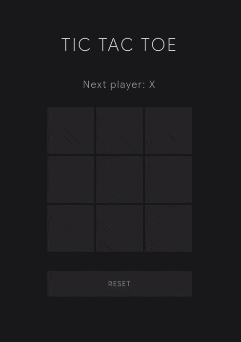

# Tic Tac Toe

A minimal Tic Tac Toe game built with React and Tailwind CSS.

This project was created to practice:

- React component structure
- State management with `useState`
- Props and component communication
- Conditional rendering
- Game logic implementation
- Clean project organization

## Features

- 3x3 interactive game board
- Two-player turn system
- Winner detection
- Draw detection
- Reset game functionality

## Tech Stack

- React
- Vite
- Tailwind CSS

## Live Demo

- Vercel: [xo-arena-ap.vercel.app/](https://xo-arena-ap.vercel.app/)

## Preview

  

